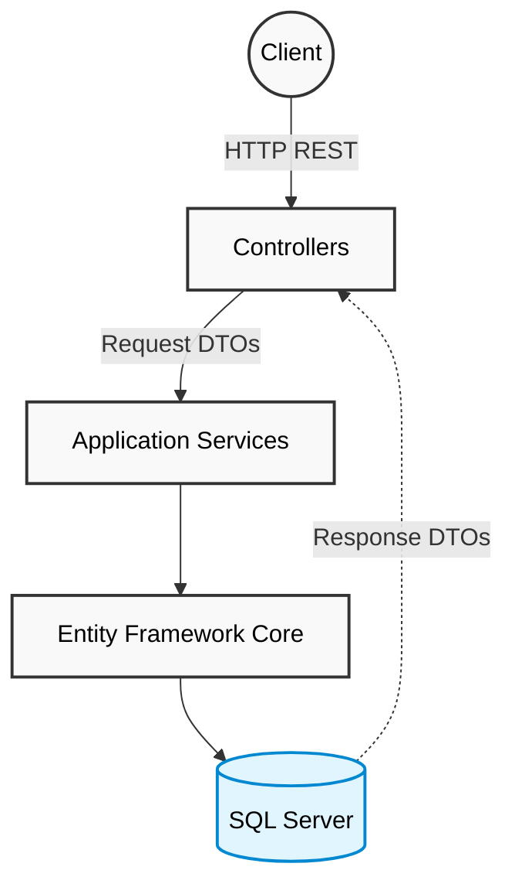
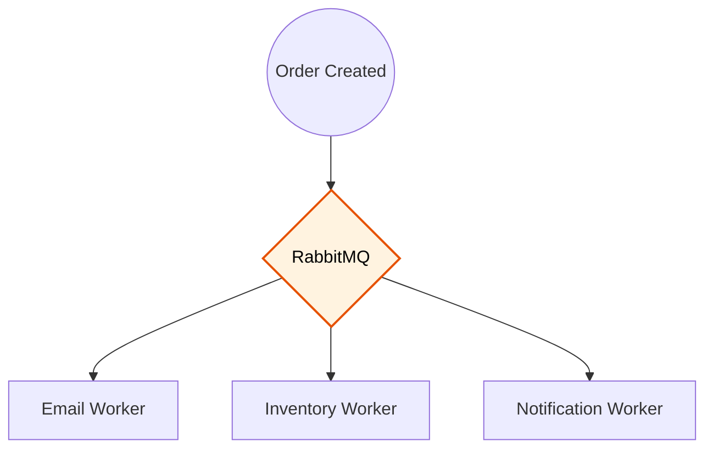
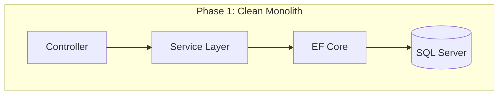
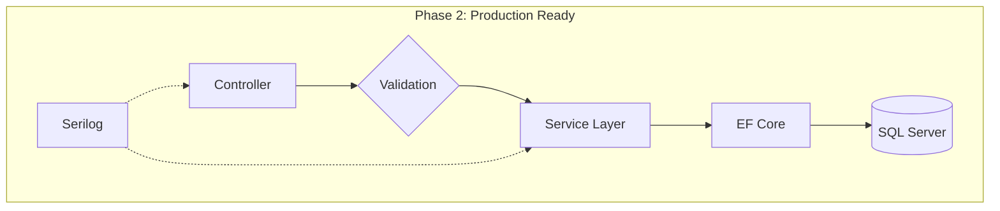
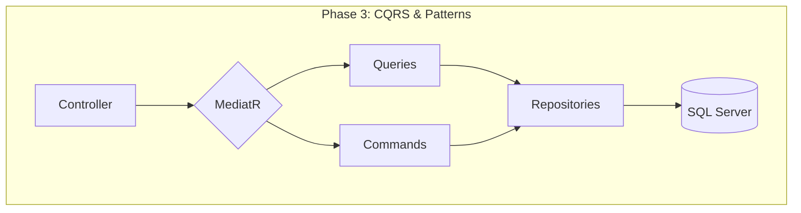
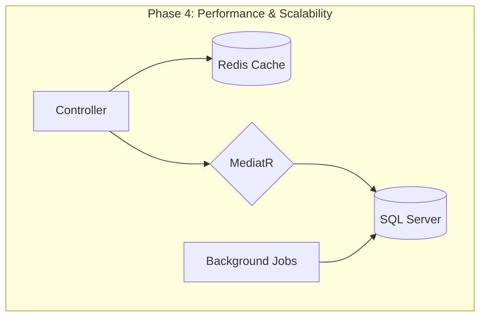
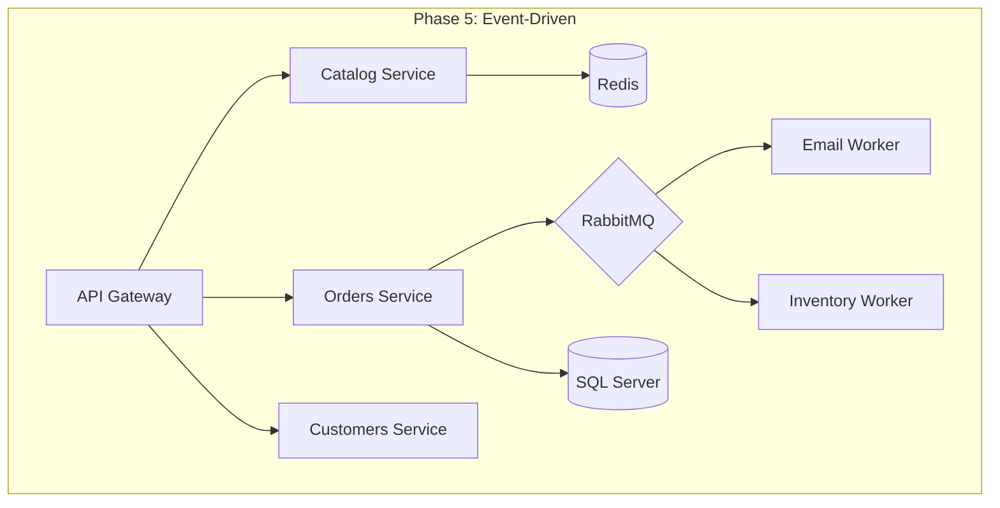

# ScaleStore – Enterprise E-Commerce Backend Evolution

> **An enterprise-grade E-Commerce backend built incrementally to demonstrate how real-world systems evolve—from a clean monolith into a scalable distributed architecture.**

---

# Overview

Most portfolio projects jump straight into microservices, RabbitMQ, Redis, CQRS, and dozens of enterprise patterns.

Real software rarely evolves that way.

**ScaleStore** intentionally grows in phases, introducing each architectural pattern only when the previous design reaches its limitations. 

The goal is to understand not only **how** enterprise technologies work, but **why** they are introduced.

---

# Project Goals

* Build a production-quality ASP.NET Core backend
* Follow Clean Architecture principles
* Learn enterprise software design incrementally
* Understand *why* enterprise patterns exist by artificially stressing the system
* Demonstrate architectural evolution
* Deploy a cloud-ready distributed system

---

# Current Architecture



Current design principles:

* Clean Architecture
* Dependency Injection
* DTO-based API Contracts
* RESTful APIs
* Entity Framework Core
* SQL Server

---

# Current Tech Stack

| Category | Technology |
| --- | --- |
| Runtime | .NET 10 |
| Framework | ASP.NET Core Web API |
| Language | C# |
| Architecture | Clean Architecture |
| ORM | Entity Framework Core |
| Database | SQL Server |
| API Documentation | OpenAPI / Swagger |

> Technologies like Redis, RabbitMQ, CQRS, Hangfire, Docker, and Azure will be introduced in later phases as the architecture evolves.

---

# Current Solution Structure

```text
ScaleStore
├── ScaleStore.Api
│   ├── Connected Services
│   ├── Dependencies
│   ├── Properties
│   ├── Controllers
│   ├── Logs
│   ├── Middleware
│   ├── appsettings.json
│   ├── Program.cs
│   └── ScaleStore.Api.http
│
├── ScaleStore.Core
│   ├── Dependencies
│   ├── DTOs
│   ├── Entities
│   ├── Interfaces
│   ├── Mappings
│   └── Validators
│
└── ScaleStore.Infrastructure
    ├── Dependencies
    ├── Data
    ├── Migrations
    └── Services

```

---

# Development Roadmap

## ✅ Phase 1 — Monolithic Foundation

### Architecture

* [x] Solution Structure
* [x] Clean Architecture
* [x] Dependency Injection
* [x] Entity Framework Core
* [x] SQL Server Integration
* [x] OpenAPI / Swagger

### Product Module

* [x] GET Products
* [x] POST Products
* [x] GET Product by Id
* [x] UPDATE Product
* [x] DELETE Product

### Order Module

* [x] CRUD APIs
* [x] Service Layer Abstraction

### Customer Module

* [x] CRUD APIs
* [x] Service Layer Abstraction

### API Features

* [x] DTO Mapping
* [x] Pagination
* [x] Filtering
* [x] Sorting
* [x] Search

---

## ⏳ Phase 2 — Production Readiness (*Current*)

### Database Architecture (Refactoring)

* [ ] Entity Relationships (Foreign Keys & Navigation Properties)
* [ ] Complex LINQ Queries & EF Core `.Include()`

### Validation

* [x] FluentValidation

### Logging

* [x] Serilog
* [x] Structured Logging

### Error Handling

* [x] Global Exception Middleware
* [x] Problem Details Responses

### Testing

* [ ] xUnit
* [ ] Moq
* [ ] Integration Tests
* [ ] TestContainers
* [ ] 80%+ Code Coverage

---

## ⏳ Phase 3 — Business Complexity

As business logic grows, CRUD alone becomes difficult to maintain.

New architectural patterns will be introduced.

### Architecture

* [ ] Repository Pattern (where appropriate)
* [ ] Unit of Work
* [ ] CQRS (MediatR)
* [ ] Domain Events

### Business Features

* [ ] Inventory Management
* [ ] Product Categories
* [ ] Discount Engine
* [ ] Order Processing Workflow

---

## ⏳ Phase 4 — Performance, Concurrency & Scalability

### Database Performance

* [ ] Mass Data Seeding & Bulk Inserts (10M+ rows via `SqlBulkCopy`)
* [ ] SQL Query Optimization & Execution Plans
* [ ] Index Tuning & Composite Indexes (Leftmost-prefix rule)
* [ ] Eliminate N+1 Queries
* [ ] Connection Pooling

### Concurrency

* [ ] Sequential vs. Concurrent I/O (`Task.WhenAll`)
* [ ] Bounded Concurrency (`SemaphoreSlim`)
* [ ] Rate Limiting & Backpressure

### Latency & Observability

* [ ] Structured Metrics (P50, P95, P99)
* [ ] Distributed Tracing & OpenTelemetry
* [ ] Correlation IDs

### Resilience

* [ ] Timeouts & CancellationToken
* [ ] Retry Policies & Exponential Backoff
* [ ] Circuit Breaker Pattern

### Caching

* [ ] Redis & Distributed Cache
* [ ] Cache-aside Pattern
* [ ] Cache Invalidation Strategy & TTL

### Background Processing

* [ ] Hangfire
* [ ] Daily Reports
* [ ] Scheduled Cleanup Jobs

---

## ⏳ Phase 5 — Event-Driven Architecture

The application begins transitioning toward distributed services. This is where CAP Theorem concepts (eventual consistency, partition tolerance) are practically applied.

### Messaging

* [ ] RabbitMQ
* [ ] Publish Domain Events
* [ ] Consume Events
* [ ] Outbox Pattern (Reliability)

### Worker Services

* [ ] Email Worker
* [ ] Notification Worker
* [ ] Inventory Worker

Example flow:



---

## ⏳ Phase 6 — Cloud & DevOps

### Containers

* [ ] Docker
* [ ] Docker Compose

### CI/CD

* [ ] GitHub Actions
* [ ] Automated Tests
* [ ] Automated Deployment

### Azure

* [ ] Azure App Service
* [ ] Azure SQL
* [ ] Azure Cache for Redis
* [ ] Azure Service Bus

---

# Planned Architecture Evolution











---

# Getting Started

## Prerequisites

* .NET 10 SDK
* SQL Server
* Visual Studio 2026 (or VS Code)
* Docker Desktop *(for later phases)*

---

## Running the Project

Clone the repository:

```bash
git clone [https://github.com/the-sauravkumar/ScaleStore.git](https://github.com/the-sauravkumar/ScaleStore.git)

```

Navigate to the solution:

```bash
cd ScaleStore

```

Apply database migrations:

```bash
dotnet ef database update

```

Run the API:

```bash
dotnet run --project ScaleStore.Api

```

Open Swagger:

```text
https://localhost:<port>/swagger

```

---

# Learning Objectives

This project explores:

* Clean Architecture
* SOLID Principles
* REST API Design
* DTOs & API Contracts
* Entity Framework Core
* Validation
* Logging & Observability
* Testing
* CQRS
* Concurrency & Resilience
* Redis
* RabbitMQ
* Background Workers
* Docker
* Azure
* CI/CD

---

# Why This Project?

Instead of showcasing a finished architecture, **ScaleStore documents the engineering journey**.

Each phase introduces new technologies only after they solve a real architectural problem, mirroring how production systems typically evolve over time. **We don't just introduce a technology when a problem appears; we introduce the technology because we have experimentally demonstrated the problem under load.**

---

# License

Licensed under the **[MIT License](LICENSE)**.
