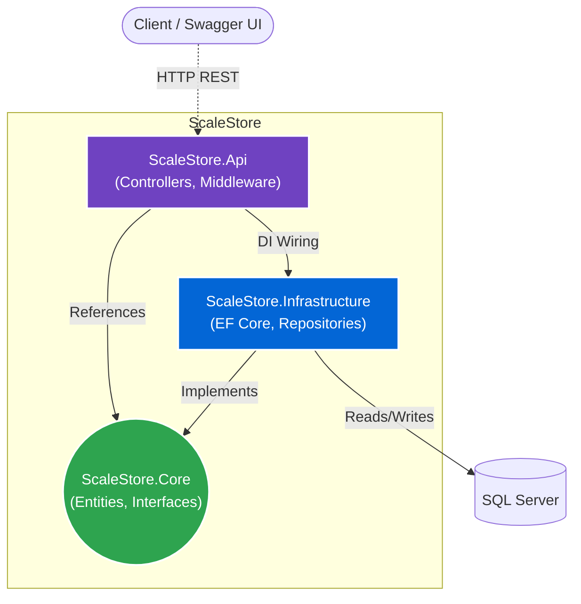

# ScaleStore (Evolutionary Architecture)

## Overview
This project is a fully featured E-Commerce backend built to demonstrate the evolution of a software system. It starts as a foundational Monolithic CRUD API and progressively scales into a containerized, event-driven architecture utilizing message queues, distributed caching, and background workers.

> **Note:** This repository serves as a practical implementation of Clean Architecture, SOLID principles, and enterprise-grade design patterns.

---

## Tech Stack

| Category | Technologies Used |
| :--- | :--- |
| **Core** | C#, .NET 8, ASP.NET Core Web API |
| **Architecture** | Clean Architecture, CQRS, Repository Pattern |
| **Data & Storage** | SQL Server, EF Core, Redis |
| **Messaging & Background** | RabbitMQ, Hangfire, Hosted Services |
| **Testing** | xUnit, Moq, TestContainers |
| **DevOps & Cloud** | Docker, Docker Compose, Azure App Service, GitHub Actions |

---

## System Architecture (Current State)

---

## The Journey: System Evolution
This project is built in deliberate phases to mimic the growth of a real-world startup application.

### Phase 1: The Monolithic Foundation (In Progress)
- [x] Implemented Clean Architecture (Domain, Application, Infrastructure, API).
- [ ] Built core CRUD REST APIs for Products, Customers, and Orders.
- [ ] Integrated Entity Framework Core with SQL Server.
- [ ] Added Pagination, Filtering, and Sorting for catalog endpoints.

### Phase 2: Production Readiness (Planned)
- [ ] Centralized Exception Handling via Global Middleware.
- [ ] Integrated Serilog for structured logging.
- [ ] Added FluentValidation for robust request validation.
- [ ] Achieved 80% code coverage using xUnit and Moq.

### Phase 3: Performance & Background Processing (Planned)
- [ ] Optimized SQL queries (Index tuning, resolving N+1 issues).
- [ ] Implemented Hangfire for scheduled background tasks (Daily sales reports).
- [ ] Added Outbox Pattern for reliable database operations.

### Phase 4: Distributed System Integration (Planned)
- [ ] Introduced Redis for caching product catalogs and reducing database load.
- [ ] Integrated RabbitMQ for asynchronous event processing (e.g., `OrderPlacedEvent`).
- [ ] Split Email and Notification logic into separate worker services consuming messages.

### Phase 5: Cloud & Containerization (Planned)
- [ ] Containerized API, SQL Server, Redis, and RabbitMQ via `docker-compose`.
- [ ] Set up CI/CD pipelines using GitHub Actions.
- [ ] Deployed infrastructure to Microsoft Azure (App Service, Azure SQL, Service Bus).

---

## Getting Started (Local Development)

### Prerequisites
* Visual Studio 2026
* .NET 10 SDK
* Docker Desktop (for running infrastructure dependencies)

### Running the Application
1. Clone the repository.
2. Navigate to the solution directory.
3. Run `docker-compose up -d` to spin up SQL Server, Redis, and RabbitMQ.
4. Update connection strings in `appsettings.Development.json`.
5. Run the `ScaleStore.Api` project.
6. Navigate to `https://localhost:<port>/swagger` to view the API documentation.

## License

This project is licensed under the [MIT License](LICENSE).